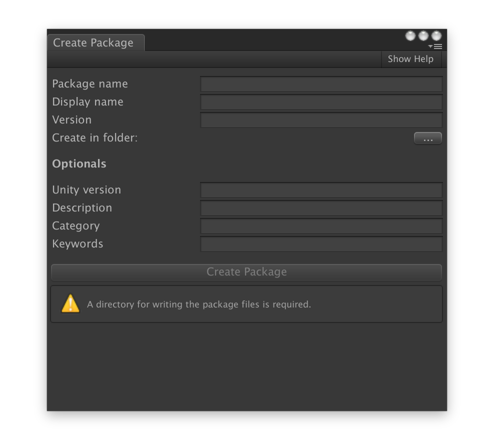

# Mlib Editor
General editor tools.

## Create Package

A simple tool that will create a **package.json** and an **Assembly Definition** in a folder of your choice.

Accessible from *Tools > Mlib > Create Package ..*.

The top most fields are required. A validation method checks that all required fields are correctly filled in before enabling the **Create Package** button.

